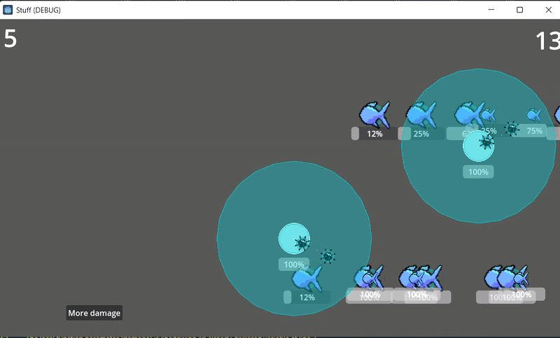

# Godot game

Trying some stuff with godot.
Looks like a sort of tower defense but with other bits

## Arts
I'm only using assets that I made myself. Not the most beautiful but still works.

## Preview (latest version)

## Task list (ideas in any order)
- [x] Tower shoots on closest enemy
- [x] 2nd Tower shoots on strongest enemy
- [x] Tower aim strategy to be able to do more
- [ ] Bullets that shoot straight instead of following
- [ ] Make bullet disappear after x time without touching rather than killing them if there is no target
- [ ] Bullets that can bounce
- [ ] Bullets that create small bullets on explode
- [ ] Tower animation - follow target
- [ ] Tower shoot animation
- [ ] Bullet touch animation
- [ ] Enemy move animation <- Working on
- [ ] Enemy destroyed animation
- [ ] Waves of enemy
- [ ] Fishes follow path
- [ ] More strategies for the projectiles
- [ ] Shop system to improve towers
